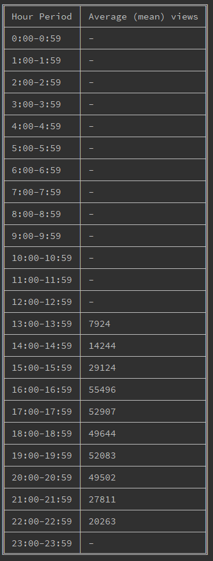

# table-text-from-csv

This code will parse csv data, process the text into numbers for processing/calculations, then output text files into the local filesystem.

I have used JavaScript and nodeJS as that is where I probably have the most experience, though with a front end focus! This kind of processing I would normally do in something like Perl 5.x

## Getting Started

have node installed on your machine!

using a terminal: 

navigate to an empty working directory on your computer, clone the project with `git clone <insert url here>`, then run `npm install` in parent project directory, then `node app.js` to execute the script and output the table data into 2 text files.

## Built With

* [node filesystem api](https://nodejs.org/docs/latest/api/fs.html) - to read and write data locally.
* [papa parse](https://www.papaparse.com) - to parse CSV data.
* ['table' from npm ](https://www.npmjs.com/package/table) - used to output data into a formatted table.

## Authors

* **Adam Razzak** 

## Acknowledgements

* readme template: https://gist.github.com/PurpleBooth/109311bb0361f32d87a2
* table npm info: https://stackoverflow.com/questions/47135815/write-data-as-table-structure-in-text-file-using-nodejs
* nodejs file write info: https://stackoverflow.com/questions/2496710/writing-files-in-node-js
* nodejs file read info: https://code-maven.com/reading-a-file-with-nodejs

## project preview:

table data screens:

